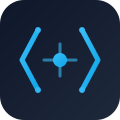

# MWM - Software Solutions | شركة حلول برمجية متكاملة

<div align="center">



**Professional software development company specializing in web apps, mobile apps, APIs, and full-stack platforms.**

**شركة تطوير برمجيات متخصصة في بناء تطبيقات الويب والموبايل والأنظمة المتكاملة.**

[](https://nextjs.org/)
[](https://nodejs.org/)
[](https://www.typescriptlang.org/)
[](https://www.mongodb.com/)
[](https://flutter.dev/)
[](https://laravel.com/)

[Live Demo](https://mwm.com) · [Portfolio](https://mwm.com/en/projects) · [Contact Us](https://mwm.com/en/contact)

</div>

---

## What We Build

| Category                 | Technologies                        | Projects                                                  |
| ------------------------ | ----------------------------------- | --------------------------------------------------------- |
| **Full-Stack Platforms** | Next.js + Node.js/Express + MongoDB | Bagour Delivery, Sana3y, Wasalni, E-Score, Saudi Host     |
| **Web Applications**     | Next.js + PostgreSQL/Prisma         | Price Hunter, Ebn Kathier, Email Validator, CSV Converter |
| **Mobile Apps**          | Flutter + Dart                      | Bagour App, Sana3y App, Wasalni App, Nawawi 40 Hadith     |
| **E-Commerce**           | Laravel + Filament + Livewire       | Dare E-Commerce Platform                                  |
| **Backend APIs**         | Node.js/Express, Python/Flask       | E-Score API (25 modules), Clinic Booking (88 endpoints)   |
| **Automation & Bots**    | Puppeteer, BullMQ, Python           | Price scrapers, WhatsApp bots, Data scrapers              |
| **Marketing Websites**   | Next.js + Tailwind CSS              | SmartStand Egypt, LG Branches, Khamsat Portfolio          |

## Portfolio Highlights

**33+ completed projects** across 6 categories:

- **Bagour Delivery** — Full food delivery platform (6 sub-projects: backend, admin, customer app, driver app, restaurant app, shared)
- **Wasalni** — Ride-hailing platform with real-time GPS tracking, driver matching, and Paymob payments
- **E-Score** — Esports platform with 25 API modules, Socket.io real-time, and iOS Live Activities
- **Price Hunter** — Price comparison monitoring 15+ stores with automated scraping and alerts
- **Clinic Booking System** — Medical appointments with 88 documented API endpoints (Laravel + Next.js)
- **Ebn Kathier Academy** — Quran memorization platform with student tracking (Next.js 16 + Prisma + PostgreSQL)
- **Dare E-Commerce** — Bilingual online store with Filament 3 admin panel

## This Repository — MWM Corporate Website

A bilingual (Arabic/English) corporate website platform with CMS capabilities, built as an npm monorepo.

### Tech Stack

| Layer        | Technologies                                                                                  |
| ------------ | --------------------------------------------------------------------------------------------- |
| **Frontend** | Next.js 14, TypeScript, Tailwind CSS (RTL), next-intl, TanStack Query, Zustand, Framer Motion |
| **Backend**  | Express.js, TypeScript, MongoDB + Mongoose, Redis, JWT (HttpOnly cookies), Socket.io          |
| **Shared**   | `@mwm/shared` — types, constants, utilities (tsup, dual ESM/CJS)                              |
| **Testing**  | Jest + RTL (frontend), Jest + mongodb-memory-server (backend), Playwright (E2E, 5 browsers)   |
| **DevOps**   | Docker Compose, GitHub Actions CI/CD, PM2, Nginx                                              |

### Features

- **Bilingual (AR/EN)** — Full RTL support, dynamic language switching, locale-prefixed URLs
- **Dark/Light Mode** — Class-based theme switching with full coverage on all pages
- **33+ Portfolio Projects** — Dynamic project showcase with category filtering
- **7 Blog Posts** — Technical blog with category and tag filtering
- **Admin Dashboard** — 16 admin sections: content, services, projects, team, blog, careers, settings, and more
- **SEO Optimized** — Dynamic sitemap, JSON-LD schemas, Open Graph, hreflang alternates, keyword-rich metadata
- **Contact System** — Form with reCAPTCHA, email notifications, message management
- **Careers Portal** — Job listings with search/filter, online applications
- **Newsletter** — Subscriber management and email campaigns
- **Real-time** — Socket.io notifications for admin dashboard

### Project Structure

```
mwm/
├── backend/          # Express.js API server (TypeScript, MongoDB, Redis)
├── frontend/         # Next.js 14 App Router (TypeScript, Tailwind CSS)
├── packages/
│   └── shared/       # Shared types, constants, utilities (@mwm/shared)
├── docker/           # Docker Compose configs (dev, test, prod)
└── docs/             # Documentation, brand identity, screenshots
```

## Quick Start

```bash
# Prerequisites: Node.js 20+, MongoDB 6+, Redis 7+

# Clone and install
git clone https://github.com/mahmoodhamdi/mwm.git
cd mwm
npm install

# Setup environment
cp backend/.env.example backend/.env
cp frontend/.env.example frontend/.env.local

# Start databases (Docker)
npm run docker:dev

# Seed database
cd backend && npm run seed && cd ..

# Start development
npm run dev
# Backend: http://localhost:5000 | Frontend: http://localhost:3000
```

## Scripts

| Command               | Description                             |
| --------------------- | --------------------------------------- |
| `npm run dev`         | Start backend + frontend concurrently   |
| `npm run build`       | Build all (shared → backend → frontend) |
| `npm test`            | Run all tests                           |
| `npm run lint`        | Lint all packages                       |
| `npm run docker:dev`  | Start MongoDB + Redis (dev)             |
| `npm run docker:prod` | Full production stack                   |

## API Documentation

- **Swagger UI:** http://localhost:5000/api/docs
- **OpenAPI JSON:** http://localhost:5000/api/docs.json

## Contact

|              |                                  |
| ------------ | -------------------------------- |
| **Email**    | mwm.softwars.solutions@gmail.com |
| **Phone**    | +201019793768                    |
| **Location** | Cairo, Egypt                     |

---

**Built with expertise in Next.js, Node.js, Flutter, Laravel, and modern web technologies.**

© 2024-2026 MWM Software Solutions. All rights reserved.
